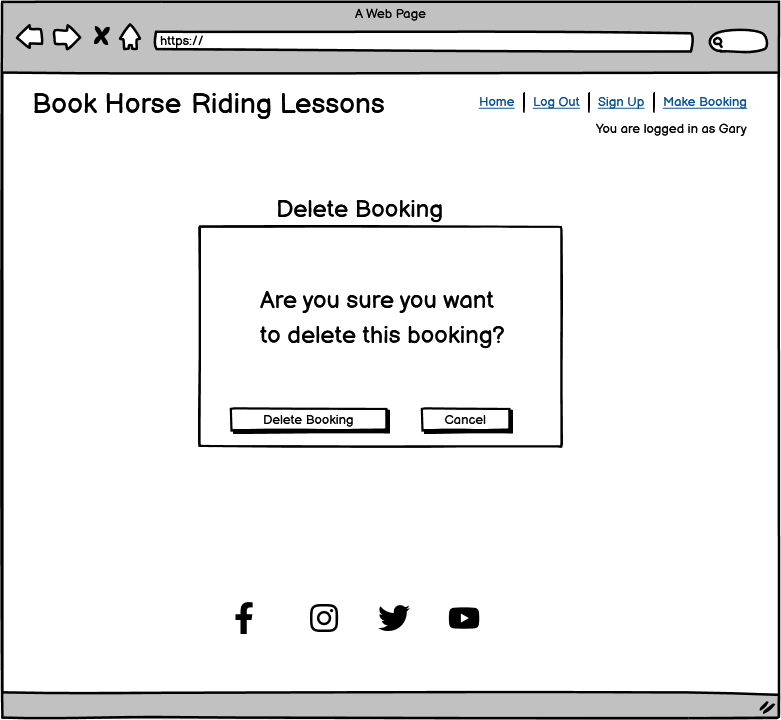
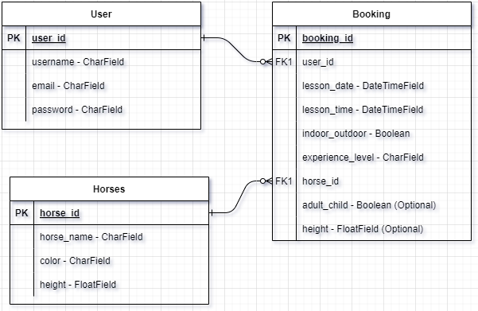

# Book Horse Riding Lessons

Click [here](https://book-horse-riding-lesson-c2e71d72733b.herokuapp.com) for the live link.

## Purpose

The Horse Riding Lessons booking system allows users to book horse riding lessons. The user can set up a personal account by signing up to the site. When they are signed up they can login to their account to book a lesson. They can choose a date and time, whether they want the lesson indoor or outdoor, their level of experience and the horse they want for the lesson. When they book a lesson they can choose to edit the booking to make changes to it or they can delete the booking. There is a seperate page showing all the horse available and their details. The user can also see the three most popular horses on the Home page.

## Table of Contents

### [User Experience](#user-experience-ux)
* [Project Goals](#project-goals)
* [Target Audience](#target-audience)
* [New user](#first-time-user)
* [Registered user](#registered-user)
* [Admin user](#admin-user)
### [Agile Methodology](#agile-methodology)
* [Epics](#epics)
* [User Stories](#user-stories)
### [Design](#design-1)
* [Color Scheme](#color-scheme)
* [Horse Images](#horse-images)
* [Wireframes](#wireframes)
* [Database Scheme](#database-scheme)
### [Features](#features-1)
* [Security Features](#security-features)
* [Existing Features](#existing-features)
* [Future Features](#future-features)
### [Technologies Used](#technologies-used-1)
* [Languages Used](#languages-used)
* [Databases Used](#databases-used)
* [Frameworks Used](#frameworks-used)
* [Programs Used](#programs-used)
### [Deployment and Local developement](#deployment-and-local-developement-1)
* [Heroku Deployment](#heroku-deployment)
* [Local Developement](#local-developement)
* [ElephantSQL Database](#elephantsql-database)
### [Testing](#testing-1)
### [References](#references-1)
* [Credits](#credits)
* [Acknowledgments](#acknowledgments)

## User Experience (UX)

### Project Goals

To allow users to:
* Book horse riding lessons.
* Create a personal account by signing up to the website.
* Set up a username and password for their account.
* Log in to their personal account.
* Choose a date and time for their lesson.
* Choose if they want their lesson indoor or outdoor.
* Choose their level of experience.
* Choose what horse they want for their lesson.
* Make changes to any bookings they have made.
* Delete a booking they made.
* See all the horses available with a picture of the horse and their height and color.
* See a list of available times for lessons.
* See the three most popular horses.
* Log out of their account.
* See a message confirming they are logged out.

### Target Audience
The website is designed to allow people to book horse riding lessons. They can choose the date and time for their lesson, whether they would like it indoor or outdoor, their level of experience and what horse they would like for their lesson. With the CRUD (Create, Read, Update, Delete) functionality they can also view, edit and delete their bookings when they log into their account.

Each user has the ability to:

### New User
* View the lesson times available
* See the three most popular horses
* Access to the Horses page to see all available horses and their details
* Register their own personal account

### Registered User
* Login to their account
* Make a booking
* View their bookings
* Update their bookings
* Delete their bookings

### Admin User
* Make a booking
* View bookings for all users
* Update bookings for all users
* Delete bookings for all users
* Add new horses to the website
* Upload pictures of the horses
* View details of all horses
* Update details of all horses
* Delete horses from the website

[Back to Top](#book-horse-riding-lessons)

## Agile Methodology
* I used agile methodology for this project as it required a lot of planning.
* The Kanban Board was created using GitHub. The link to the board is [here](https://github.com/users/Soro82/projects/2).
* I used six milestones for the project, one for each Epic. 
* The milestones were helpful in tracking my progress through the project. 
* The User Stories were divided up into three categories - must have, should have and could have. 
* I used labels to categorise the user stories.
* The User Story for the user to enter their age and height when registering is the only User Story incomplete. 
* I had originally planned to add this to the website because I had intended for the admin user to assign horses to each booking. * I decided to allow the user to choose which horse they would like to book instead.

### Epics

* Set up Project
* Deployment
* Navbar Links
* User Registration
* Book a Lesson
* Add a Horses Page

### User Stories

#### Epic: Set up Project

* Create the project and book_lesson app
* Create the database
* Build the models
* Create the views
* Create the templates

#### Epic: Deployment

* Open a new Heroku application
* Add required Config Vars
* Set up a Procfile
* Set DEBUG to False

#### Epic: Navbar Links

* Links in navbar to login, log out, sign up and make a booking
* Log out and make a booking are disabled when no user is logged in
* Logged in username displayed when a user is logged in
* Burger icon replaces navbar on smaller screens

#### Epic: User Registration

* Set up account with a username, email and password
* Enter my age and height when registering
* See a message stating that I am logged in
* Have a logout button visible
* See a confirmation message when i logout

#### Epic: Book a Lesson

* Choose a date for a lesson
* Choose a time for a lesson
* Choose whether I want indoor or outdoor
* Choose my level of experience from a list of options
* See a list of possible lesson times
* See a confirmation message when i make a booking

#### Epic: Add a Horses Page

* See pictures of each horse on a page
* See details of each horse under their picture
* Have a "Book Now" button available under each horse in the Horses page

[Back to Top](#book-horse-riding-lessons)

## Design

### Color Scheme
* I wanted a color palette that was warm and welcoming but also energetic.
* I did a google search for the top 50 website color schemes but I couldn't find any that I like for this website.
* I tried a few combinations myself before settling on this one:

### Horse Images
All the images of the horses were downloaded from https://www.pexels.com
The images were resized and converted to .webp using https://www.resizepixel.com

### Wireframes

Home Page

* Mobile

* Tablet

* Desktop

Horses Page

* Mobile

* Tablet

* Desktop

Booking Page

* Mobile

* Tablet

* Desktop

My Bookings Page

* Mobile

* Tablet

* Desktop

Edit Booking Page

* Mobile

* Tablet

* Desktop

Delete Booking Page

* Mobile

* Tablet

* Desktop

Login/Sign Up Pages

* Login

* Sign Up

### Database Scheme

[Back to Top](#book-horse-riding-lessons)

## Features

### Security Features

#### User Authentication
* Django comes with a user authentication system called AllAuth. 
* It handles user accounts, groups, permissions and cookie-based user sessions.
* The Django authentication system handles both authentication and authorization. 
* Authentication verifies a user is who they claim to be, for example when a user is logging in to the website. 
* Authorization determines what an authenticated user is allowed to do, for example in the navbar in base.html we check if the user is logged in using this line of code: .

#### CSRF (Cross Site Request Forgery)
* CSRF attacks allow a malicious user to execute actions using the credentials of another user without that user’s knowledge or consent.
* Django has built-in protection against most types of CSRF attacks.
* CSRF protection works by checking for a secret in each POST request. 
* This ensures that a malicious user cannot “replay” a form POST to your website and have another logged in user unwittingly submit that form. 
* The malicious user would have to know the secret, which is user specific (using a cookie).

#### The login_required Decorator
* The login_required decorator is on all views that require the user to be logged in.
* In this website it was used on the booking, edit_booking and delete_booking views. It ensures that only authenticated users can access these views.

#### Custom Error Pages
* The 404 and 500 Error Pages are used to allow the user to return to the website’s home page.
* They use the base.html to inform the user of their error in a friendly and helpful manner.

#### Form Validation
The booking form and edit_booking forms are validated to ensure:
* The date entered is a current date.
* The user has not previously booked a lesson for the date and time they have chosen.
* The user has not previously booked the same horse for the date and time they have chosen.
* The horse has not been previously booked for the date and time they have chosen.
* The lesson is not full (lessons are limited to 4 people).

### Existing Features

### Future Features

[Back to Top](#book-horse-riding-lessons)

## Technologies Used

### Languages Used
* HTML5
* CSS
* JavaScript
* Python

### Databases Used
* ElephantSQL - Postgres Database
* Cloudinary - Stores static files

### Frameworks Used
* Django - https://www.djangoproject.com
* Bootstrap v5.3 - https://getbootstrap.com

### Programs Used
* GitHub - to host the source code.
* GitPod - IDE used to develop the website.
* Heroku - to deploy the project.
* W3C Markup Validation Service - to validate the HTML code.
* W3C CSS Validation Service - to validate the CSS code.
* JSHint - to validate the JavaScript code.
* CI Pep8 Python Validator - to validate the Python code.
* Am I Responsive - to test the website's resonsiveness.

[Back to Top](#book-horse-riding-lessons)

## Deployment and Local Development

### Heroku Deployment

The website was deployed using [Heroku](https://www.heroku.com/) through the following steps.

1. Log in to Heroku or create an account if necessary.
2. Click on the button labeled "New" from the dashboard in the top right corner and select the "Create new app" option in the drop-down menu.
3. Enter a unique name for the application and select the region you are in.
4. Click on "create app".
5. Navigate to the settings tab and locate the "Config Vars" section and click "Reveal config vars".
6. To add a config var:
   * In the "KEY" field - enter the KEY name in all capital letters.
   * In the "VALUE" field - enter the actual key and click "Add".
8. Scroll to the "Buildpacks" section and click "Add buildpack".
9. Select Python and save changes.
12. Navigate to the "Deploy" section by clicking the "Deploy" tab in the top navbar.
13. Select "GitHub" as the deployment method and click "Connect to GitHub".
14. Search for the GitHub repository name in the search bar.
15. Click on "connect" to link the repository to Heroku.
16. Scroll down and click on "Deploy Branch".
17. Once the app is deployed, Heroku will notify you and provide a button to view the app.

Click [here](https://book-horse-riding-lesson-c2e71d72733b.herokuapp.com) for the live link.

### Local Development

#### Forking

Forking is a way to make a copy of the original repository on your GitHub account to view and change without affecting the original repository.

* Log in to GitHub and locate your GitHub Repository.
* At the top of the Repository(under the main navigation) locate the "Fork" button.
* Now you should have a copy of the original repository in your GitHub account.

#### Cloning

* Log in to GitHub and locate the GitHub Repository.
* Under the repository name click "Clone or download".
* Click on the code button, select clone with HTTPS, SSH or GitHub CLI and copy the link shown.
* Open Git Bash.
* Change the current working directory to the location where you want the cloned directory to be made.
* Type git clone and then paste The URL copied in step 3.
* Press Enter and your local clone will be created.

### ElephantSQL Database

* Click Create New Instance to start a new database.
* Provide a name (this is commonly the name of the project: tribe).
* Select the Tiny Turtle (Free) plan.
* Leave the Tags blank.
* Select the Region and Data Center closest to you.
* Once created, click on the new database name, where you can view the database URL and Password.

[Back to Top](#book-horse-riding-lessons)

## Testing

| Location | Test | Expected Result | Result |
| :------: | :--: | :-------------: | :----: |
| Navbar | Click on Login | Opens the login page | Passed |
|  | Click on Sign Up | Opens the signup page | Passed |
|  | Click on Horses | Opens the horses page | Passed |
|  | Click on Logout | Opens the logout page | Passed |
|  | Click on Heading in navbar | Opens the home page | Passed |
|  | Login | Sign Up and Login links change to User's name | Passed |
|  | Logout | User's name link change to Sign Up and Login | Passed |
| Popular Horses | Click on Login | Opens the login page | Passed |
|  | Click on Book Now | Opens the booking page | Passed |
| Horses Page | Click on Login | Opens the login page | Passed |
|  | Click on Next | Display next 3 horses | Passed |
|  | Click on Previous | Display previous 3 horses | Passed |
|  | Click on Book Now | Opens the booking page | Passed |
| Login Page | enter invalid username | Error message displayed | Passed |
|  | Enter invalid password | Error message displayed | Passed |
|  | Click on Sign Up | Opens the signup page | Passed |
|  | No password entered | Please fill in this field | Passed |
|  | No username entered | Please fill in this field | Passed |
|  | Enter valid username and password | Successfully logged in message | Passed |
| Booking Page | No date entered | Please fill in this field | Passed |
|  | Horse not choosen | Please fill in this field | Passed |
|  | Date earlier than today | Error message displayed | Passed |
|  | Date and time already booked | Error message displayed | Passed |
|  | Horse already booked | Error message displayed | Passed |
|  | Lesson fully booked | Error message displayed | Passed |
|  | Click on Submit | Confirmation Message displayed | Passed |
|  | Click on Submit | Confirmation Message disappears after 3 seconds | Passed |
|  | Click on Submit | Form fields cleared | Passed |
| My Bookings Page | Click on Edit | Opens the edit booking page | Passed |
|  | Click on Delete | Opens the delete booking page | Passed |
| Edit Booking Page | No date entered | Please fill in this field | Passed |
|  | Horse not choosen | Please fill in this field | Passed |
|  | Date earlier than today | Error message displayed | Passed |
|  | Date and time already booked | Error message displayed | Passed |
|  | Horse already booked | Error message displayed | Passed |
|  | Lesson fully booked | Error message displayed | Passed |
|  | Click on Update Booking | Confirmation Message displayed | Passed |
|  | Click on Update Booking | Return to bookings page | Passed |
| Delete Booking Page | Click on Confirm Delete | Booking deleted | Passed |
|  | Click on Confirm Delete | Confirmation Message displayed | Passed |
|  | Click on Confirm Delete | Return to bookings page | Passed |
| 404 Error Page | Enter incorrect URL | 404 Error Page opens | Passed |
|  | Click on Take Me Home | Returns to Home Page | Passed |
| 500 Error Page | Admin raises an exception | 500 Error Page opens | Passed |
|  | Click on Take Me Home | Returns to Home Page | Passed |

## References

### Credits
* I used https://docs.djangoproject.com for Django documentation.
* I used https://getbootstrap.com/docs/5.3 to learn more about Bootstrap.
* I used https://www.w3schools.com to simplify some of the documentation in Django and Bootstrap.

### Acknowledgments 

[Back to Top](#book-horse-riding-lessons)